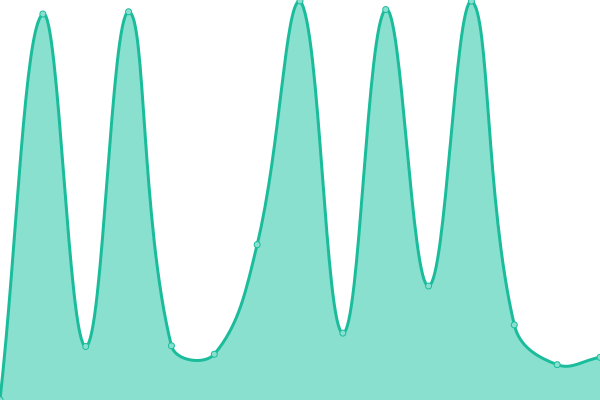

# [📈 Live Status](https://DevHives.github.io/tcc-0001): <!--live status--> **🟩 All systems operational**

<!--start: status pages-->
<!-- This summary is generated by Upptime (https://github.com/upptime/upptime) -->
<!-- Do not edit this manually, your changes will be overwritten -->
<!-- prettier-ignore -->
| URL | Status | History | Response Time | Uptime |
| --- | ------ | ------- | ------------- | ------ |
|  [Tipperay County Council](https://www.tipperarycoco.ie) | 🟩 Up | [tipperay-county-council.yml](https://github.com/DevHives/tcc-0001/commits/HEAD/history/tipperay-county-council.yml) | 

 499ms
     
 | 

<a href="https://DevHives.github.io/tcc-0001/history/tipperay-county-council">100.00%</a>
    

|  [Tipperary County Council Consultations](https://consultations.tipperarycoco.ie) | 🟩 Up | [tipperary-county-council-consultations.yml](https://github.com/DevHives/tcc-0001/commits/HEAD/history/tipperary-county-council-consultations.yml) | 

 488ms
     
 | 

<a href="https://DevHives.github.io/tcc-0001/history/tipperary-county-council-consultations">100.00%</a>
    

|  [Tipperary The Place The Time](https://tipperary.ie) | 🟩 Up | [tipperary-the-place-the-time.yml](https://github.com/DevHives/tcc-0001/commits/HEAD/history/tipperary-the-place-the-time.yml) | 

 503ms
     
 | 

<a href="https://DevHives.github.io/tcc-0001/history/tipperary-the-place-the-time">100.00%</a>
    

|  [Tipperary Tourism](https://tipperary.com) | 🟩 Up | [tipperary-tourism.yml](https://github.com/DevHives/tcc-0001/commits/HEAD/history/tipperary-tourism.yml) | 

 684ms
     
 | 

<a href="https://DevHives.github.io/tcc-0001/history/tipperary-tourism">100.00%</a>
    

|  [Tipperary Tourism](https://whatsonintipp.ie) | 🟩 Up | [tipperary-tourism.yml](https://github.com/DevHives/tcc-0001/commits/HEAD/history/tipperary-tourism.yml) | 

 684ms
     
 | 

<a href="https://DevHives.github.io/tcc-0001/history/tipperary-tourism">100.00%</a>
    

<!--end: status pages-->
